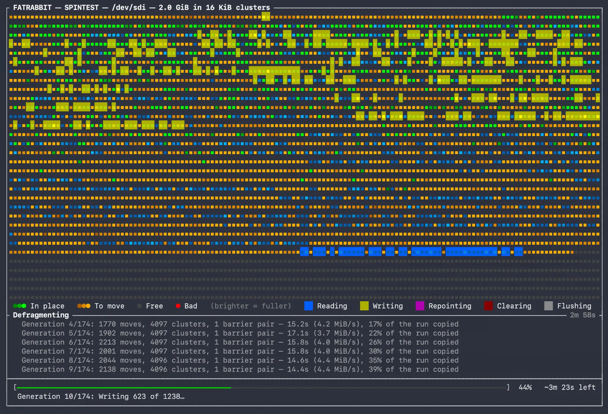

# fatrabbit


Defragments a FAT volume in place — FAT12, FAT16 or FAT32 — so that every file and directory ends up
occupying a single contiguous run, then rewrites the FATs and boot record to match.

It is aimed at removable media and at the machines that read it: cards in cameras, samplers, synths,
handhelds, car stereos, and anything else whose firmware reads a FAT volume with a simple loop and
no readahead worth the name. On hardware like that, layout *is* performance. A file scattered across
forty extents costs forty seeks on a spinning drive and forty command round-trips on a card, and no
amount of host-side cleverness helps a device that has none.

That audience is why FAT16 is here and not only FAT32. Samplers, car stereos, flash carts, industrial
and medical instruments and anything on a card under 2 GB are very largely FAT16, and they are
precisely the primitive readers this tool exists for. FAT12 comes along because it is nearly the same
code, not because a volume of under 4,085 clusters has much to gain.

Written in Swift 6, runs on macOS and Linux. One dependency, Apple's
[swift-argument-parser](https://github.com/apple/swift-argument-parser).

## What it does



- **Makes every file and directory contiguous.** One run of clusters each, in ascending order.
- **Draws free space toward the end of the volume**, so what remains is one large run rather than
  thousands of holes.
- **Places directories with their entire subtree**, so a folder and its contents are read as one
  sweep instead of a walk back and forth across the volume.
- **Leaves a FAT12/16 root directory alone**, because on those two variants it is a fixed region
  between the tables and the data area rather than a cluster chain. Nothing points at it and nothing
  can move it, so the first data cluster goes to the first real entry instead. On FAT32 the root
  *is* a chain, and it is placed first.
- **Lets you choose what goes where.** `--first` and `--last` pin named root-level entries to the
  front or the back, in the order given — useful when a device reads a particular file at startup,
  or plays a card in directory order.
- **Reclaims orphans.** Clusters that are allocated but unreferenced — the residue of a previous
  interrupted run, or of a device that lost power mid-write — are returned to free space.
- **Optionally strips macOS metadata** (`--deMac`): `._` AppleDouble sidecars, `.DS_Store`,
  `.Spotlight-V100`, `.fseventsd`, `.Trashes`, and friends. Useful when the card is going back into
  a device that will display those as if they were real files.

## Requirements

| | |
| --- | --- |
| Swift | 6.2 or later |
| macOS | 26.3 or later |
| Linux | any distribution with a Swift 6.2+ toolchain |
| Filesystem | FAT12, FAT16 or FAT32 — not exFAT, which is a different filesystem |
| Privileges | root for a device node; none at all for an image file |

## Building

On macOS there is a Homebrew tap:

```sh
brew install ptsochantaris/tap/fatrabbit
```

That builds from source on your machine — there is no bottle — so it wants the same toolchain the
table above asks for, and takes about as long as a `make release` would. Everything below is for
working from a checkout, which is still the only route on Linux.

The same two commands on macOS and on Linux:

```sh
git clone https://github.com/ptsochantaris/fatrabbit
cd fatrabbit
make release                 # -> .build/release/fatrabbit
make install                 # -> /usr/local/bin/fatrabbit
```

Run `make install` as yourself, not under `sudo`: it builds as you and escalates only the copy, and
only if the destination needs it. `make install PREFIX=~/.local` lands somewhere you already own and
asks for nothing.

`make release` is the build to ship: `-O` and whole-module from the release configuration,
`-Ounchecked` from the manifest, and full LTO. That last one is why there is a Makefile at all —
LTO has to be a flag to `swift build` and cannot be expressed in a package manifest. The
[Makefile](Makefile) says why at length, along with what it is and is not worth.

`swift build -c release` and opening `Package.swift` in Xcode both work fine, and produce a slightly
larger binary without the LTO. Good for editing and debugging.

Two wrinkles if you build in a container: the official `swift` images do not ship `make`, so
`apt-get install -y make` first, or use `swift build -c release` and forgo the LTO. And the first
build needs network access, to fetch the one dependency.

### Checking the Linux build from a Mac

The Makefile also carries a containerised build, used during the port to check that the Linux half
of the platform seam still compiles without needing a Linux box to hand:

```sh
make linux                   # debug build inside swift:6.3.3 via Docker
make linux-shell             # interactive shell in the same image (--privileged, for losetup)
```

The image is pinned to the same toolchain version the Mac runs, so a diagnostic can only mean a
platform difference and never a toolchain one. `make linux-shell` needs `--privileged` because
exercising the mount check for real requires a loop device.

### What differs between the platforms

Only one file each. The FAT format layer, the planners, the defragmenter and the display are the
same code everywhere; the platform seam is eight members in
[`Platform.swift`](Sources/Fatrabbit/Platform/Platform.swift), implemented once per OS. The
differences that are real rather than cosmetic:

| | macOS | Linux |
| --- | --- | --- |
| Device node | `/dev/diskN` is redirected to the raw `/dev/rdiskN` | one node per disk, used as given |
| Page cache | bypassed via the raw node | sits underneath, and may defer writes past the point they are reported |
| Durability barrier | `fsync` + `DKIOCSYNCHRONIZECACHE` | `fsync` alone, which is sufficient here |
| Image files | attached images, found via the IORegistry | loop devices, found via sysfs |
| Listing devices | one walk over `IOMedia`, which states outright how each medium is attached and what type its partition table gave it | a directory of sysfs files, which states neither: removability is inferred, and partition types are not published at all |
| Unmounting | `diskutil unmount` | `umount` |

## Usage

```
fatrabbit [<volume>] [options]
```

`<volume>` is an **unmounted** FAT device node or an image file. Which variant it is follows from the
volume's own cluster count and is worked out on opening — there is no flag for it.

Leave it out and fatrabbit lists what is attached and asks:

```
Attached FAT volumes:

   1  /dev/disk4s1  FAT32   29.8 GiB  "CAMERA"    SanDisk Extreme
   -  /dev/disk6s1  FAT16    1.9 GiB  "SHOOT2"    mounted
        at /Volumes/SHOOT2 — unmount it first, keeping it attached: diskutil unmount /dev/disk6s1
   2  /dev/disk8    FAT12    1.4 MiB  "BOOTDISK"  Disk Image

  Internal disks and EFI system partitions are not shown. --all-devices includes them.

Pick a volume [1-2, q to abort]:
```

The list is shown and the question asked even when only one volume was found: a run only ever starts
unprompted on a device named on the command line. Whether a device is eligible is decided by reading
its boot sector, not by asking the OS what it thinks the partition holds — a partition type byte is a
label somebody wrote once, and the volume itself is the only witness worth having.

The one type that *is* believed is the EFI system partition's, and the difference is worth stating.
`DOS_FAT_32` is a claim about what a volume contains, which only the volume can settle. The EFI type
GUID is not about contents at all: it is the partition table saying who the partition is *for*, which
is exactly the question being asked when deciding what to offer. Those partitions are FAT32, they
appear on external enclosures as readily as on a boot disk, and they are left out of the list without
being read at all.

### macOS

```sh
sudo fatrabbit                                 # list what is attached and pick one
diskutil unmount /dev/disk4s1                  # unmount, but leave the disk attached
sudo fatrabbit /dev/disk4s1 --dry-run          # see what would happen
sudo fatrabbit /dev/disk4s1                    # do it
```

Pass either `/dev/disk4s1` or `/dev/rdisk4s1` — the tool redirects itself to the raw node either
way, so it talks to the medium rather than to a cache that will decide later when the work really
happens.

### Linux

```sh
sudo fatrabbit                                 # list what is attached and pick one
sudo umount /dev/sdb1                          # unmount, but leave the device attached
sudo fatrabbit /dev/sdb1 --dry-run             # see what would happen
sudo fatrabbit /dev/sdb1                       # do it
```

Which devices count as removable is the one thing Linux states less precisely than macOS: there is no
property that says whether a disk is internal, so it is inferred from the `removable` flag, the bus
the device hangs off, and the naming of MMC cards. `--all-devices` is the answer where that guess
goes the wrong way.

### On an image file, with no privileges at all

An image file is a first-class target, and a user-owned one needs no `sudo`:

```sh
fatrabbit card.img --dry-run
fatrabbit card.img
```

Handy for trying the tool out, and for verifying a change byte-for-byte across two builds. If the
image is currently attached — `hdiutil attach -nomount` on macOS, `losetup` on Linux — and anything
from it is mounted, the run is refused and told to you in the verb your platform actually uses.

### Options

| Option | Effect |
| --- | --- |
| `--first A,B,...` | Root-level entry names to place ahead of everything else, in the order given |
| `--last X,Y,...` | Root-level entry names to place after everything else, in the order given |
| `--deMac` | Strip macOS metadata while defragmenting, and clear the hidden attribute from every `.` and `..` entry |
| `--fast` | Keep the existing order and never shove one object aside for another, so nothing is copied twice |
| `--plain` | Report as plain lines rather than drawing the block map |
| `--no-pause` | Do not hold the finished block map on screen waiting for a key |
| `--dry-run`, `-n` | Go through the whole run writing nothing; the volume is opened read-only |
| `--verify-copies` | Check every span against the medium as it is copied, and stop if the medium contradicts itself |
| `--all-devices` | List every attached FAT volume, holding nothing back |
| `--verbose` | Per-object and per-cluster relocation detail |
| `--version` | Show the release number, which a build installed from a tarball has no other way to state |
| `--help`, `-h` | Show usage |

Names given to `--first` and `--last` match 8.3 short names, case-insensitively.

`--fast` is the one worth understanding. The default is willing to move an object out of the way to
let another take the slot it wants, which produces the tightest layout but can copy the same data
twice. `--fast` never does that: every file still ends up in one piece and free space is still drawn
toward the end, but compaction becomes opportunistic — an object that cannot claim its slot outright
is left where it is, so some gaps survive. On a volume that has drifted rather than shattered, it is
much less work for nearly the same result.

On a volume too full to move anything aside at all, a default run does both, in two passes: the
`--fast` layout first, which frees the room a shuffle needs, and then the full one on top of it. It
says which pass it is on and why, since the figures start again from zero at the second one. That is
roughly twice the data moved, so it takes about twice as long — and it is the only way that volume
reaches the layout you asked for, because the run that used to be attempted instead left some data
parked in scratch space and reported success.

Where even that would not finish cleanly, the run stops before writing anything, says how much space
is free and how much of it is anywhere useful, and leaves the choice to you: free some space, or ask
for `--fast` and accept a layout that is contiguous but not ordered.

`--dry-run` still *reads* every source cluster the plan wants to move, which proves the data is
actually readable before a real run relies on it. The volume still has to be unmounted.

`--all-devices` affects the list only, never what a named device is allowed to be. Two things are held
back without it, and neither out of squeamishness. Fixed disks, because a machine that boots UEFI
keeps a FAT32 system partition on the disk it boots from. And EFI system partitions wherever they
live, because they turn up on external enclosures too — all three of the USB and NVMe enclosures this
was developed against carry one, so they are not a rare sight in a list of removable media, and 200 MB
of firmware payload is the last thing anybody reaching for this tool meant.

Under the flag the list makes no judgement, but it does still say which row is which: internal and EFI
rows are marked and sorted below the rest, since asking for them back is not the same as wanting to
pick one blind.

## Output

By default, on an interactive colour terminal with room for it, fatrabbit draws a live block map: the
volume as a coloured grid, the current phase and elapsed time, a pane of recent log lines, and a
progress bar with an estimate.

The map draws on the alternate screen, so your scrollback is left untouched, and every line it showed
is written out to stderr when it closes. A run watched on the map therefore leaves behind exactly the
same transcript as one run with `--plain`. A completed run holds the finished map on screen until a
key is pressed; `--plain` exits as soon as it is done.

`--no-pause` drops that wait, for a run nobody is sitting in front of — scheduled, or driven from a
script — which would otherwise hold a finished map open for a key that is never coming. The
transcript written out on the way is the same either way. A run stopped by Ctrl-C or by an error has
never waited: you have already been told what you need to know.

Lines are used instead of the map automatically when the map would not work or would only get in the
way: redirected output, `--verbose`, a window under 60×20, `NO_COLOR`, or a terminal that says it is
dumb.

### Exit codes

| Code | Meaning |
| --- | --- |
| 0 | Completed |
| 1 | Error — not a FAT volume, mounted volume, I/O failure |
| 64 | Bad arguments (`EX_USAGE`) |
| 130 | Stopped by Ctrl-C; the volume is consistent and a later run resumes |

## Safety

The volume is modified in place, but never destructively. Every relocation is a copy into clusters
the FAT says are *free*, followed by a commit — nothing referenced is ever overwritten:

1. copy the data into free clusters,
2. allocate the copy as a chain in the FAT,
3. flip every pointer to the object over to the copy,
4. release the original chain.

Steps 3 and 4 sit behind durability barriers: allocations reach the medium before anything names
them, and the pointer flips reach the medium before the clusters they abandoned can be handed out
again. That ordering is the whole safety argument, and it means an interruption — Ctrl-C, a yanked
cable, a power cut — costs at most some clusters that are allocated but referenced by nothing. The
next run reclaims them as orphans.

Ctrl-C once stops after the batch in flight, leaving a consistent, partly defragmented volume that a
later run carries on from. Ctrl-C twice stops immediately; the design survives that too, since it is
precisely what a power cut does.

One thing does differ on FAT12, and it is worth knowing:

- **On FAT12, an interrupted run is flagged in the boot record and nowhere else.** The other two
  variants also clear a clean-shutdown bit in FAT entry 1, which is the flag most tools check.
  Twelve bits leave no room for one, so FAT12 has never had it. The volume is still consistent — the
  copy-then-repoint design is what guarantees that — but your operating system is less likely to
  offer to check it for you.

Two things worth knowing before you point it at something you care about:

- **A mounted volume is refused outright**, dry run or not. This is the one hazard copy-then-repoint
  cannot cover: the kernel holds its own cached copy of the FAT and directory blocks and will write
  them back over ours whenever it pleases. Unmount the volume but leave the device attached.
- **Back up anything irreplaceable.** The design is careful and the failure mode is benign, but this
  is a tool that rewrites filesystem metadata on removable media. Use `--dry-run` first.

### When the medium itself is the problem

Not all devices report honest transfer size limits. That can lead to a read coming back with the
wrong bytes, which is then copied faithfully to the right place: the FAT agrees, every pointer
agrees, `fsck` is content, and the data is wrong. Nothing in the filesystem records that it happened.

Three defences, the first two automatic:

- **Transfer sizes come from the device** rather than being guessed at. Where a device asks for less
  than the default, the run says so.
- **The stated size is then tested**, because devices lie about it. A USB card reader measured during
  development advertises 128 KiB and mishandles it in both directions — silently, no error at any
  level — under a pattern that any defragmenter produces as a matter of course. One run lost 338
  clusters and a directory that way, reporting a single error an hour in.

  So each run writes a deliberately awkward pattern into spare space, reads it back, checks both
  directions, and settles on the largest size the medium actually honours — timing the survivors and
  taking the fastest. On that reader the answer is 64 KiB, which is also **45% faster** than the size
  it claims. Where the test cannot run, the run says which: either there was no spare room in one
  piece, or it was a dry run, which cannot write and so checks reads only.
- **`--verify-copies`** checks every span in both directions as it is copied — read twice by
  different routes, and read back off the medium after writing — and stops if the medium contradicts
  itself. It roughly doubles the traffic of the copy phase (+23% of wall clock against an image, more
  against a card), so it is off by default. The startup test catches the misbehaviour that has been
  characterised; this catches the rest. Either way a failure costs nothing: no copy is referenced by
  anything until after it is checked, so the run stops with the original still live and the volume as
  it was found.

If you verify such a card yourself, read it in transfers no larger than the size it honours. A bulk
hash pass at a size the device mishandles will report corruption in files that are perfectly intact.
[`Testing/haunt.py`](Testing/haunt.py) asks a device the question directly.

## Measurement harness

[`Testing/`](Testing/) holds the Python harness this was tuned with, and its
[README](Testing/README.md) is the record of what was measured and why each change was made.

It exists because **an image file on an SSD is not a drive.** It reads and writes an order of
magnitude faster, overlaps reads with writes, and absorbs small writes into a cache — so it will
happily report "no difference" for a change worth 13% on real hardware, and "8% slower" for one that
is faster. Anything performance-related has to be measured on the medium the tool is actually for.

## License

MIT — see [LICENSE](LICENSE).
